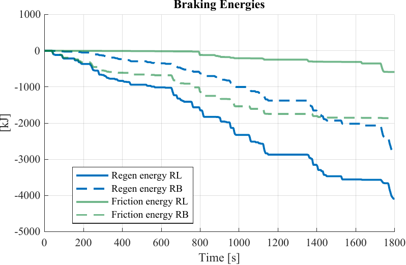

# Regenerative Braking System with Smart Energy Recovery

A **reinforcement-learning controller for regenerative braking** in a battery-electric
vehicle. A **Deep Deterministic Policy Gradient (DDPG)** agent acts as a **torque-split
controller**, deciding how much braking to send to the **regenerative** system versus
the **friction** brakes — under a **dynamic battery charge limit** from an
**HPPC-inspired State-of-Power (SoP) estimator** — to recover as much energy as
possible. Trained and evaluated in a Simulink/Simscape EV-drivetrain simulation.

> **MSc thesis** — Electro-Mechanical System Design, Aalborg University (10th semester,
> final master's thesis), 2025. **Joint work with Bjartur Ragnarsson á Norði** (equal
> collaboration, no split of tasks). Vehicle modelled: **Škoda Enyaq** (VW MEB platform).
>
> 📄 **Peer-reviewed publication from this thesis** — MDPI *Machines*:
> <https://www.mdpi.com/2075-1702/14/4/416>
> 📕 **Full thesis:** [`docs/thesis.pdf`](docs/thesis.pdf)

## Headline result

Against a rule-based baseline on the same drive cycle, the learned agent recovers
substantially **more** energy through regeneration and dissipates far **less** in the
friction brakes:



- **Regen energy** — RL agent ≈ **4100 kJ** vs rule-based ≈ 2700 kJ (**~50% more recovered**)
- **Friction loss** — RL agent ≈ **600 kJ** vs rule-based ≈ 1900 kJ (**~⅓ the waste**)

_(RL = the DDPG agent; RB = rule-based baseline. Full results across WLTP and extreme
drive cycles, SoC levels, and slopes are in [`docs/thesis.pdf`](docs/thesis.pdf).)_

## How it works

- **Agent:** a DDPG actor–critic (`build_or_load_agent_01.m` → `rlDDPGAgent`), trained
  in a Simulink RL environment on the EV-drivetrain model.
- **Action:** the braking torque split (regen vs friction).
- **Observations:** drivetrain state plus the battery's dynamic power limit.
- **State-of-Power estimator:** an HPPC-inspired model giving a *time-varying*
  charge-power ceiling the agent must respect.
- **Reward:** maximise use of the available regenerative capability while penalising
  charge-limit violations and abrupt (uncomfortable) control actions.

## Repository layout

```
regenerative-braking-thesis/
├── docs/
│   └── thesis.pdf                 the full master's thesis (all results & derivations)
├── model/                         the Simulink/Simscape model + DDPG pipeline
│   ├── Beautiful_powertrain.slx        EV drivetrain + RL-agent model
│   ├── build_or_load_agent_01.m        builds the DDPG actor/critic agent
│   ├── Train_1.m                       agent training
│   ├── evaluate_general.m              evaluation and logging
│   ├── ev_init.m / setup_project_00.m  vehicle/battery init and project setup
│   └── actionMap.m / utils_rl.m        helpers
└── figures/
    └── braking_energies.png       RL agent vs rule-based energy recovery
```

**Built with** MATLAB · Simulink · Simscape (Battery Builder) · Reinforcement
Learning Toolbox (DDPG, `rlSimulinkEnv`).
